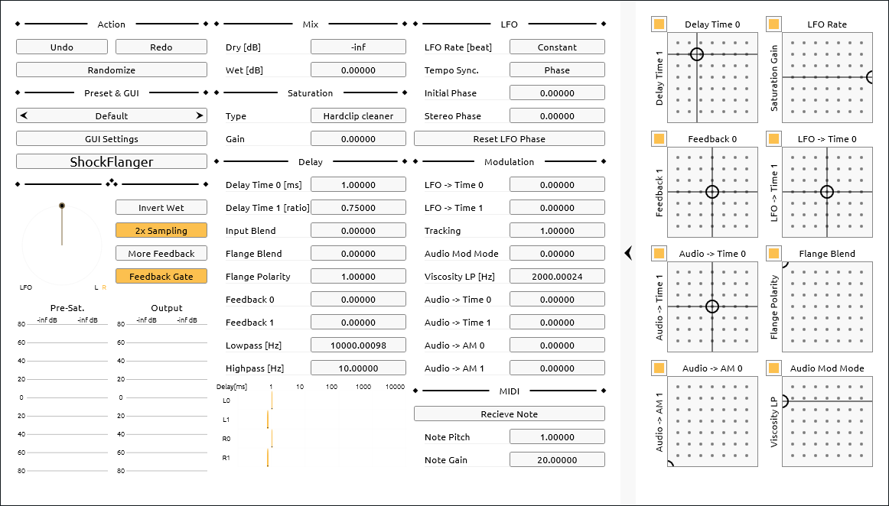

ShockFlangerは、フランジャーの構造をしたディストーションで、ギターアンプのような音が出ます。内部はスルーゼロフランジャーに近く、フィードバック経路に配置されたサチュレーターと、オーディオレートでのディレイ時間変調の組み合わせで歪みが出ます。

サチュレーターにおける 4 次の逆微分アンチエイリアシング (ADAA) や、 256 タップの可変 FIR によるディレイ時間変調のアンチエイリアシングによって、それなりにクリーンな歪みになっていますが、 CPU 負荷はとても高いです。

- [ダウンロード (github.com)](https://github.com/ryukau/UhhyouPluginsJuce/releases)
- [インストールと設定方法を読む]()

## 警告
大音量。ShockFlangerの後段に必ずリミッターを配置することを推奨します。

 の一部のオプションは  を上げると +100 dB を超える振幅を出力するおそれがあります。

 と  が高い状態で  を有効にすると発振するおそれがあります。発振とは入力が無音でも音が止まらなくなる状態のことです。

 と  の量が多いと、破裂音のようなノイズが発生するおそれがあります。

 は、しきい値が固定です。 S/N 比が低い信号を扱うときは前段に別のゲートを配置することを推奨します。

## クイックスタート

基本のレシピを示します。

### フランジャー

1.  、  を上げる。
2.  、  を決める。 1 ~ 10 ms 。
3.  を下げる。 8 前後。
4.  を決める。
5.  、  を決める。 1 以下。
6. 歪みを避けるなら  を下げる。

### ディストーション

ShockFlanger は以下のようなエフェクターチェーンに組み込むことを想定して作られています。

```
イコライザー → ShockFlanger → イコライザー → コンボルバー (キャビネットのインパルス応答)
```

以下は歪みのレシピです。

1.  、  を上げる。
2.  、  を決める。
3.  、  を上げる。
4.  、  を変える。

以下は歪みの微調整に関わるパラメータです。

- 
-  と 
-  、 
-  、 

音の高い部分がザラザラとしすぎているときは  を 10000 Hz 前後まで落とすことを検討してください。原則としては ShockFlanger 側の歪みを抑えて、キャビネットのインパルス応答で落とすほうが自然な質感になります。

 は歪みの特性を変えることに特化した配置になっているので、直流を落としきれないことがあります。外部のイコライザーを活用してください。

## 入出力
- 1 ステレオ入力 (2 チャンネル)
- 1 ステレオ出力 (2 チャンネル)
- 1 MIDIまたはノートイベント入力

## 計器
- 左中: LFO の位相。
- 左下: ピークメーター
  - Pre-Sat.: サチュレーター前段の振幅。
  - Output: 出力振幅。
- 中央下: ディレイ時間。

## パラメーター

### ∴ (その他)


処理された信号 (wet) の位相を反転。



2 倍のオーバーサンプリング。有効時は CPU 負荷倍増。高域の特性が変わる。



有効時は  が `0.0` より大きいときにフィードバックを増加。有効時は  あるいは外部ゲートとの併用を推奨。



入力信号がしきい値以下のときにディレイのフィードバックを 0 に落とすゲート。しきい値はおよそ -26 dB 。  が 0 dB より小さいときは、しきい値が下がる。

```
feedbackGateThreshold = 0.05 * min((Saturation Gain), 1.0).
```



### Mix (ミックス)



バイパスされた入力信号のゲイン。



処理された信号のゲイン。



### Saturation (サチュレーション)



サチュレーションのアルゴリズム。



サチュレーター段の前に適用されるゲイン。



### Delay & Feedback (ディレイ & フィードバック)



ディレイ 0 のディレイ時間。ミリ秒 (ms) 。



ディレイ 1 の相対的なディレイ時間。  に対する比率。



1 チャンネルあたりに備えられた 2 つのディレイへの入力比。 ShockFlanger はステレオで動作するので 2 * 2 の計 4 つのディレイを持つ。 Input Blend は左右のチャンネルで同じ値が使われる。



スルーゼロフランジャーとフィードバックディレイネットワーク (FDN) の切り替え。

- `0.0`: サイズ 2 の FDN 。
- `1.0`: スルーゼロフランジャー。



スルーゼロフランジャー経路のフィードバック極性。値が正確に `-1.0` または `1.0` でなければ、全波整流された信号がミックスされる。



ディレイ 0 および ディレイ 1 へのフィードバックゲイン。



フィードバックループ内のフィルターのカットオフ周波数。



### LFO



LFO の同期モード。

- `Phase`: ホストの再生時刻 (transport) に位相を同期。  変更時にノイズが生じる。
- `Frequency`: ホストの BPM に周波数を同期。位相はフリーランニング。  をオートメーションするときに適当。
- `Off`: 同期速度を 120 BPM に固定。位相はフリーランニング。



LFO 周波数。単位は拍（beats）。同期速度は  の設定に準じる。



LFO の初期位相。



左右の LFO の位相差。



押し続けることで LFO を  にリセット。



### Modulation (変調)
ここでは入力信号とフィードバック信号によるディレイ時間の変調のことをオーディオ変調と呼びます。



LFO によるディレイ 0 のディレイ時間の変調量。単位はオクターブ。



LFO によるディレイ 1 のディレイ時間の変調量。単位はオクターブ。



オーディオ変調を行う信号をクロスフェード。

- `0.0`: サチュレーターを通った入力信号。
- `1.0`: ローパスフィルターを通ったフィードバック信号。



オーディオ変調に使われるフィードバック信号が通るローパスフィルターのカットオフ周波数。  が 0 より大きいときだけ有効。



ディレイ時間に対するオーディオ変調の強さ。



オーディオ変調信号によるフィードバック経路内での振幅変調 (AM) の深さ。



### MIDI



MIDI ノートの受信を切り替え。



MIDI ピッチによるディレイ時間の変調量。



MIDI ベロシティによるサチュレーター前段のゲインの変調量。



## 更新履歴
- 0.1.0
  - 初版。
